  

<h2 align="center">
  Software Engineer | Full Stack Developer | AI/ML Enthusiast
</h2>

  

---

## > About

<pre>
Name: Gautam Yadav
Role: Software Engineer | Full Stack Developer | AI/ML Enthusiast

Focus:
  - Software Engineering
  - Full Stack Development
  - Java
  - Python
  - AI / ML
  - Data Structures & Algorithms
  - Problem Solving

Currently:
  - Building full-stack applications
  - Solving DSA and competitive programming problems
  - Developing AI/ML projects
  - Improving software engineering skills

Status:
  Open to Software Engineering, Software Development & AI/ML Opportunities
</pre>

---

## > find-me-here

---

## > tech-stack.json

###  languages

###  frameworks & backend

###  databases & deploy

###  AI / ML

###  also using

---

## > pinned-projects.tsx

<table>
<tr>

<td width="50%">

<h3> Employee Work Allocation System</h3>

Full-stack employee management and work allocation platform.

<b>Tech Stack</b> 
React.js • Node.js • Express.js • MongoDB

<b>Features</b> 
JWT Authentication 
Role-Based Access Control 
REST APIs 
Responsive Dashboard 
MongoDB Integration

</td>

<td width="50%">

<h3>🚦 AI Smart Traffic System</h3>

AI-powered traffic monitoring and vehicle detection system.

<b>Tech Stack</b> 
Python • OpenCV • Machine Learning • React.js

<b>Features</b> 
Vehicle Detection 
Computer Vision 
Traffic Monitoring 
Real-Time Analysis

</td>

</tr>

<tr>

<td width="50%">

<h3>🤖 Multi-Modal Evidence Review</h3>

AI-based system for analyzing claims and supporting evidence.

<b>Tech Stack</b> 
Python • AI/ML • Computer Vision

<b>Features</b> 
Claim Parsing 
Image Analysis 
Evidence Checking 
Risk Assessment

</td>

<td width="50%">

<h3>💻 DSA & Problem Solving</h3>

Consistent practice of programming and algorithmic problems.

<b>Focus</b> 
Data Structures 
Algorithms 
Java 
Problem Solving 
Competitive Programming

</td>

</tr>
</table>

---

---

## > coding-profiles.exe

 

## > github-stats.exe

  
  

---

## > github-streak.exe

  

---

## > leetcode-stats.py

  

---

## > contribution-graph.exe

  

---

## > currently-learning.exe

<pre>
01  Advanced Data Structures
02  System Design
03  Backend Development
04  AI / Machine Learning
05  Competitive Programming
</pre>

---
---
## > codolio.exe

  

## > contact.exe

<code>~$ code first, build later </code>

Thanks for visiting my profile!

