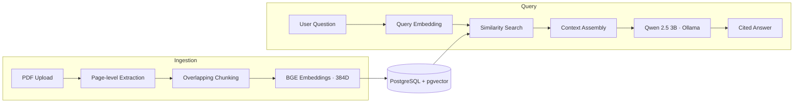

  

<h1 align="center">Hi, I'm Gautam Kumar Yadav 👋</h1>

<h3 align="center">
  Software Engineer · Full Stack Developer · AI/ML Engineer
</h3>

  I build production-oriented full-stack, backend, and AI-powered systems — 
  from secure REST APIs to RAG pipelines and ML inference services.

  
  
  
  

  

  

  <a href="#-recruiter-quick-glance">Quick Glance</a> ·
  <a href="#-featured-projects">Projects</a> ·
  <a href="#-tech-stack">Tech Stack</a> ·
  <a href="#-achievements">Achievements</a> ·
  <a href="#-github--coding-activity">Activity</a> ·
  <a href="#-lets-work-together">Contact</a>

---

## 🎯 Recruiter Quick Glance

| | |
|---|---|
| **🟢 Open to** | Software Engineering · Full Stack · Backend · AI/ML roles |
| **💪 Strongest at** | Backend APIs (Node.js / FastAPI), RAG & vector search, ML model integration, secure auth (JWT + RBAC) |
| **🛠️ Core languages** | Java · Python · JavaScript / TypeScript |
| **🏆 Proof of work** | 300+ DSA problems · Google Solution Challenge 2025 · HackIndia 2025 · Adobe University Hackathon 2026 |
| **🚀 Flagship project** | [Nexora AI](https://github.com/Gautam0804/Nexora-AI) — private-document RAG platform with page-level citations |
| **📬 Fastest way to reach me** | [gautamcodesin@gmail.com](mailto:gautamcodesin@gmail.com) |

---

## 🚀 Featured Projects

<table>
<tr>

<td width="50%" valign="top">

### 📚 Nexora AI
**AI Document Intelligence & Semantic Search**

Upload private PDFs, search them semantically, and get **RAG answers with document + page-level citations**.

**Highlights**
- 384-D BGE embeddings + **pgvector** similarity search
- Page-level extraction with overlapping chunking
- Private storage with **signed URLs**, JWT auth, bcrypt, user-level authorization
- Local LLM inference via **Ollama (Qwen 2.5 3B)**

**Stack:** `Next.js` `TypeScript` `Tailwind` `Node.js` `Express` `PostgreSQL` `pgvector` `FastAPI` `Sentence Transformers` `Supabase`

</td>

<td width="50%" valign="top">

### 🛡️ RiskForge
**Real-Time AI Fraud Detection & Risk Intelligence**

Scores transactions in real time by combining **rule-based signals, anomaly analysis, and an XGBoost model**.

**Highlights**
- FastAPI ML inference service decoupled from the main API
- Redis caching for low-latency risk lookups
- PostgreSQL persistence for transactions, risk scores, and alerts
- Risk & alert workflows for flagged activity

**Stack:** `React` `Node.js` `Express` `PostgreSQL` `Redis` `FastAPI` `XGBoost`

</td>

</tr>
<tr>

<td width="50%" valign="top">

### 🚚 RouteX
**Full-Stack Fleet Operations Platform**

Manage vehicles, drivers, shipments, assignments, tracking, and alerts from one dashboard.

**Highlights**
- JWT authentication with **role-based access control**
- Authorization middleware protecting every sensitive route
- Clean RESTful API architecture
- Shipment ↔ driver ↔ vehicle assignment workflows

**Stack:** `React` `Node.js` `Express` `MySQL` `JWT` `REST`

</td>

<td width="50%" valign="top">

### 🤖 PredictX
**AI Predictive Maintenance Platform**

Analyzes industrial sensor data (temperature, vibration) to predict **equipment health and failure risk**.

**Highlights**
- Random Forest model for failure-probability prediction
- FastAPI inference service consumed by the Node backend
- Health & risk assessment with maintenance recommendations
- MongoDB storage for sensor readings and predictions

**Stack:** `React` `Node.js` `Express` `MongoDB` `FastAPI` `Scikit-learn`

</td>

</tr>
</table>

### 🧠 Under the hood: Nexora AI's RAG pipeline

```mermaid
flowchart LR
    subgraph Ingestion
        A[PDF Upload] --> B[Page-level Extraction] --> C[Overlapping Chunking] --> D[BGE Embeddings · 384D]
    end
    D --> E[(PostgreSQL + pgvector)]
    subgraph Query
        Q[User Question] --> F[Query Embedding] --> G[Similarity Search] --> H[Context Assembly] --> I[Qwen 2.5 3B · Ollama] --> J[Cited Answer]
    end
    E --> G
```

---

## 🧰 Tech Stack

<h3>💻 Languages</h3>

  

<h3>🌐 Frontend & Backend</h3>

  

<h3>🗄️ Databases & Tools</h3>

  

<h3>🤖 AI / ML</h3>

 

  

<h3>🔐 Concepts</h3>

 

---

## 🏆 Achievements

  
  
  
  
  

---

## 📊 GitHub & Coding Activity

  

  
  

  

### 🐍 Contribution Snake

  <picture>
    <source media="(prefers-color-scheme: dark)" srcset="https://raw.githubusercontent.com/Gautam0804/Gautam0804/output/github-contribution-grid-snake-dark.svg?v=2">
    <source media="(prefers-color-scheme: light)" srcset="https://raw.githubusercontent.com/Gautam0804/Gautam0804/output/github-contribution-grid-snake.svg?v=2">
    
  </picture>

  

  

**Competitive programming & practice profiles**

  
  
  
  
  

---

## 🌱 Currently

- 🔨 Building AI-powered, production-oriented applications with RAG, vector search, and ML inference
- 🏗️ Strengthening **system design** and backend architecture
- 🧮 Going deeper on advanced data structures and competitive programming

---

## 🤝 Let's Work Together

I'm looking for **Software Engineering, Full Stack, Backend, and AI/ML** opportunities where I can ship real features and keep learning fast.

  
  

  <code>~$ build • solve • learn • improve</code>

  

